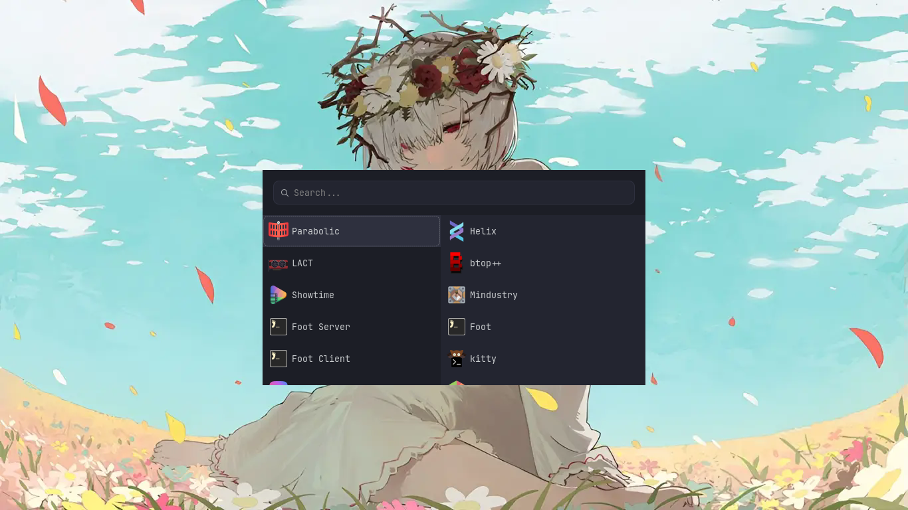
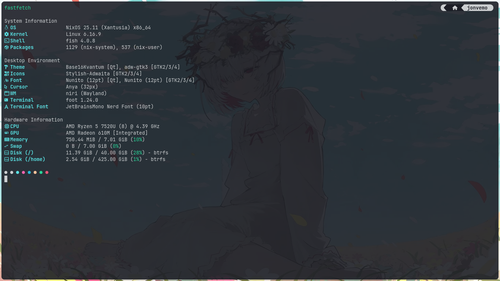
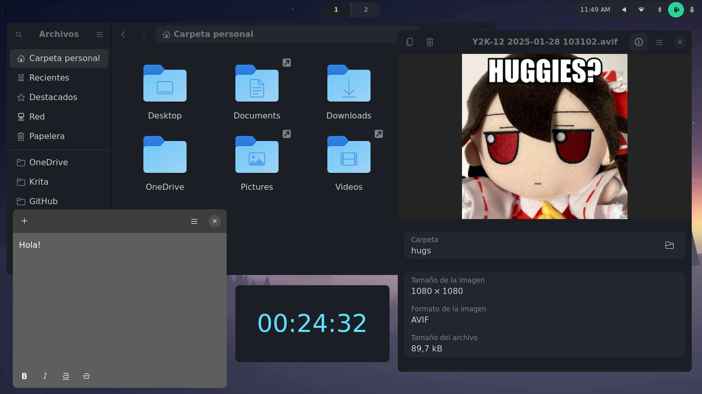
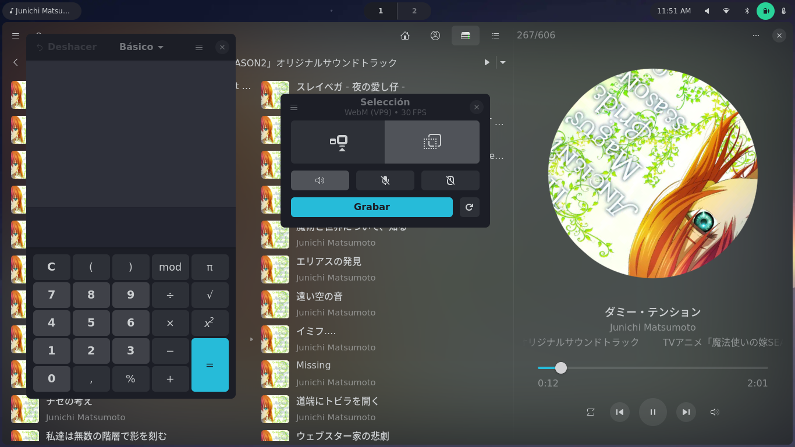

# NixOS Dotfiles



## Installation
1. Install Git and enable flakes in `configuration.nix`

```nix
environment.systemPackages = with pkgs; [
    git
];
```
```nix
nix.settings.experimental-features = [ "nix-command" "flakes" ];
```

2. Rebuild System
```
sudo nixos-rebuild switch
```

3. Clone Repo
```
git clone https://github.com/jonvemo/nixos-config.git
```

4. Copy the files except for `hardware-configuration.nix` to /etc/nixos/ and move the one created by NixOS to /host/USER/

5. Modify the users and hosts in `flake.nix`, `host/HOST/default.nix`, `host/HOST/configuration.nix` and `home/USER/default.nix`

> [!NOTE]
> Icons Theme and Cursor are not available at the time of installing this repository, you can changeit on .icons folder. Changing also, if you use other icons or cursor, in the `settings/gtk/default.nix` folder and in `programs/niri/niri.kdl`

## Preview
> [!NOTE]
> Preview images may be outdated

<details>
<summary>View Screenshots</summary>





</details>

## Technologies
|                         | Software                                                                                                                    |
| ----------------------- | --------------------------------------------------------------------------------------------------------------------------- |
| **Operating System**    | [NixOS Unstable](https://github.com/NixOS/nixpkgs/tree/nixos-unstable)                                                      |
| **Window Manager**      | [Niri](https://github.com/YaLTeR/niri)                                                                                      |
| **Theme Manager**       | [Stylix](https://github.com/danth/stylix)                                                                                   |
| **File Manager**        | [Yazy](https://github.com/sxyazi/yazi)                                                                                      |
| **Status Bar**          | [Way-edges](https://github.com/way-edges/way-edges)                                                                         |
| **App Launcher**        | [Wofi](https://hg.sr.ht/~scoopta/wofi)                                                                                      |
| **Terminal Emulator(s)**| [Kitty](https://github.com/kovidgoyal/kitty), [Foot](https://codeberg.org/dnkl/foot)                                        |
| **Shell**               | [Fish](https://github.com/fish-shell/fish-shell)                                                                            |
| **Shell Prompt**        | [Starship](https://github.com/starship/starship)                                                                            |
| **Code Editor**         | [Zed](https://github.com/zed-industries/zed)                                                                                |
| **Terminal Editor**     | [Helix](https://github.com/helix-editor/helix)                                                                              |
| **Bluetooth Manager**   | [Bluetui](https://github.com/pythops/bluetui)                                                                               |
| **Network Manager**     | [Impala](https://github.com/pythops/impala)                                                                                 |
| **Volume Control**      | [Wiremix](https://github.com/tsowell/wiremix)                                                                               |
| **Screen Recorder**     | [Kooha](https://github.com/SeaDve/Kooha)                                                                                    |
| **Cloud Storage**       | One Drive ( Unofficial client: [abraunegg/onedrive](https://github.com/abraunegg/onedrive))                                 |
| **Web Browser**         | [Zen Browser](https://github.com/zen-browser)                                                                               |
| **Music Player(s)**     | [G4Music](https://gitlab.gnome.org/neithern/g4music), [RMPC](https://github.com/mierak/rmpc)                                |
| **Video Player**        | [Showtime](https://gitlab.gnome.org/GNOME/showtime)                                                                         |
| **Image Viewer**        | [Loupe](https://gitlab.gnome.org/GNOME/loupe)                                                                               |
| **Notes**               | [Sticky](https://github.com/vixalien/sticky)                                                                                |
